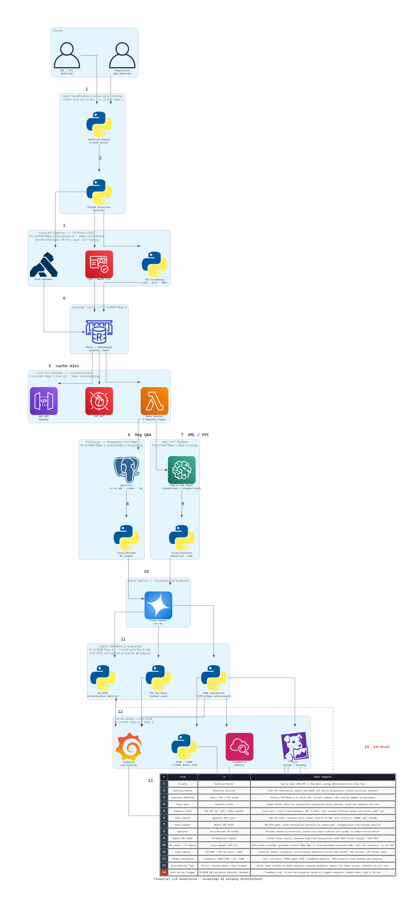

# Financial LLM Governance

> Architect and deploy sovereign AI governance infrastructure for the U.S. financial services sector — specifically, production-grade LLM orchestration and adaptive anomaly detection systems that operationalize the 230 control objectives established by the U.S. Treasury's February 2026 Financial Services AI Risk Management Framework (FS AI RMF).

---

## The National Problem

The U.S. Treasury's Financial Services AI Risk Management Framework (February 2026) identifies uncontrolled AI deployment as a source of **systemic risk** to U.S. financial markets. The framework establishes 230 control objectives across four pillars — Governance, Risk Identification, Controls, and Incident Response — yet no production-grade open-source infrastructure exists to operationalize them end-to-end.

The gap is acute in two areas:

**AML/KYC false positives.** The U.S. anti-money laundering compliance industry operates at a **90–95% false-positive rate**, costing U.S. financial institutions an estimated **$25 billion annually** in unnecessary investigation work (LexisNexis Risk Solutions, *True Cost of Financial Crime Compliance*, 2023; FinCEN Strategic Plan 2022–2025). AI-driven transaction analysis can reduce this rate by an order of magnitude — but only under rigorous governance that prevents model opacity, hallucination, and PII leakage from creating new regulatory exposures.

**Regulatory Q&A hallucination.** LLMs queried against FINRA, SEC, and FinCEN guidance produce confident but factually incorrect citations at rates incompatible with audit trail requirements under FINRA Rule 4370 and SEC Rule 17a-4. Without a verifiable output-validation layer, these systems cannot be deployed in regulated environments.

This repository is the reference architecture I designed to close both gaps.

**Regulatory anchors cited throughout this work:**
U.S. Treasury FS AI RMF (Feb 2026) · NIST AI RMF 1.0 (Jan 2023) · Executive Order 14110 (Oct 2023) · FSOC 2023 Annual Report · FinCEN Strategic Plan 2022–2025 · OWASP LLM Application Security Top 10

---

## Architecture



I designed a **9-layer, dual-path governance architecture** that routes every LLM request through a sovereign control plane before inference and validates every response before delivery. Each layer maps to at least two FS AI RMF control pillars.

### Layer Summary

| Layer | Name | FS AI RMF Pillar |
|-------|------|-----------------|
| 0 | Input Classification & Adversarial Defense | Pillar 2 — Risk Identification |
| 1 | Kong API Gateway (On-Prem / DMZ) | Pillar 1 — Governance · Pillar 3 — Controls |
| 2 | Semantic Cache (Redis + Embeddings) | Pillar 3 — Controls |
| 3 | AWS API Gateway + WAF (Cloud Boundary) | Pillar 2 — Risk Identification · Pillar 4 — Incident Response |
| 4a | RAG Layer — Regulatory Q&A Path | Pillar 1 — Governance |
| 4b | Hybrid AML / KYC Pipeline | Pillar 2 — Risk Identification |
| 5 | Azure OpenAI (GPT-4o) | — |
| 6 | Output Validation & Guardrails | Pillar 3 — Controls |
| 7 | Observability, XAI & Audit | Pillar 4 — Incident Response · Pillar 1 — Governance |
| 8 | Model Governance & Feedback Loop | Pillar 1 — Governance |

### Two Workload Paths

**Path A — AML/KYC Transaction Analysis**

```
Transaction narrative
  → Workload Router & Risk Scorer            [Pillar 2]
  → Prompt Injection Detector                [Pillar 2]
  → Kong: JWT/OAuth 2.0 + PII Scrubbing     [Pillar 1 · Pillar 3]
  → Semantic Cache (Redis)                   [Pillar 3]
  → AWS WAF + Rate Limiter                   [Pillar 2 · Pillar 4]
  → Hybrid AML Model                         [Pillar 2]
  → False-Positive Reduction Engine          [Pillar 2]
  → Azure OpenAI (GPT-4o)                    [Pillar 3]
  → ECLIPSE + PII Re-check + NeMo Guardrails [Pillar 3]
  → SHAP/LIME FINRA audit JSON + Langfuse    [Pillar 4 · Pillar 1]
```

**Path B — Regulatory Q&A**

```
Policy query
  → Workload Router & Risk Scorer            [Pillar 2]
  → Prompt Injection Detector                [Pillar 2]
  → Kong: JWT/OAuth 2.0 + PII Scrubbing     [Pillar 1 · Pillar 3]
  → Semantic Cache (Redis)                   [Pillar 3]
  → AWS WAF + Rate Limiter                   [Pillar 2 · Pillar 4]
  → pgvector RAG (FS AI RMF / FINRA / SEC / FinCEN) [Pillar 1]
  → Cross-Encoder Re-ranker                  [Pillar 3]
  → Azure OpenAI (GPT-4o)                    [Pillar 3]
  → ECLIPSE + PII Re-check + NeMo Guardrails [Pillar 3]
  → Langfuse trace                           [Pillar 4]
```

### 14-Step Data Flow

| Step | From | To | What Happens | FS AI RMF Pillar |
|------|------|----|--------------|-----------------|
| 1 | Clients | Workload Router & Risk Scorer | Requests are tagged by workload type (AML vs. Reg Q&A) and assigned a data-sensitivity risk tier (low / medium / high). | Pillar 2 |
| 2 | Workload Router | Prompt Injection Detector | Risk-tagged request is scanned for adversarial inputs — prompt injection, jailbreak patterns, and OWASP LLM Top 10 #1 attack vectors. | Pillar 2 |
| 3 | Prompt Injection Detector | Kong · JWT/OAuth 2.0 · PII Scrubbing | Kong enforces authentication; the PII middleware strips SSNs, account numbers, and ABA routing numbers before any data leaves the perimeter. | Pillar 1 · Pillar 3 |
| 4 | Kong layer | Semantic Cache | Authenticated request is checked against a vector-based semantic cache. Cache hit bypasses LLM inference entirely. | Pillar 3 |
| 5 | Semantic Cache | AWS API Gateway · AWS WAF · Rate Limiter | On cache miss, the request crosses the cloud boundary. WAF applies rule-based filtering; rate limiter enforces per-client quotas and writes a structured request log. | Pillar 2 · Pillar 4 |
| 6 | Rate Limiter | pgvector (Reg Q&A path) | Regulatory Q&A requests are routed to the vector database storing embeddings of the FS AI RMF 230 control objectives, FINRA rulebook, SEC guidance, and FinCEN advisories. | Pillar 1 |
| 7 | Rate Limiter | Hybrid AML Model (AML/KYC path) | AML/KYC transaction narratives are routed to the hybrid supervised + unsupervised anomaly detection pipeline. | Pillar 2 |
| 8 | pgvector | Cross-Encoder Re-ranker | Retrieved regulatory document chunks are re-ranked to surface the most relevant passages, reducing hallucination risk from irrelevant context. | Pillar 3 |
| 9 | Hybrid AML Model | False-Positive Reduction Engine | Initial AML risk scores pass through the false-positive reduction engine (target: **<10% false-positive rate** vs. industry baseline of **90–95%**). High-risk transactions carry a structured risk annotation into the LLM prompt. | Pillar 2 |
| 10 | Re-ranker / FP Engine | Azure OpenAI (GPT-4o) | Both paths converge. Grounded regulatory context (Reg Q&A) or risk-annotated transaction narrative (AML) is sent to the sovereign Azure OpenAI endpoint. No raw PII reaches this layer. | Pillar 3 |
| 11 | Azure OpenAI | ECLIPSE · PII Re-check · NeMo Guardrails | LLM response fans into three parallel output validators: (1) ECLIPSE detects factually incorrect regulatory citations; (2) PII re-check ensures the model did not regenerate scrubbed data; (3) NeMo Guardrails enforces STR field schema compliance. | Pillar 3 |
| 12 | Output Validation | Langfuse · SHAP/LIME · CloudWatch · SIEM | Validated responses are forwarded to the observability pipeline. Langfuse captures full LLM traces; SHAP/LIME generates per-decision feature attributions formatted as FINRA-compliant audit JSON; CloudWatch and SIEM ingest all events. | Pillar 4 · Pillar 1 |
| 13 | Observability | MLflow Registry · Human Review Queue · Eval Trigger | Audit records and model performance signals are written to the governance layer. Anomalous signals enqueue human review; the eval trigger schedules re-evaluation runs. | Pillar 1 |
| 14 | Eval Trigger | ECLIPSE *(feedback loop)* | When reviewers flag an incorrect output or the eval trigger fires, a re-evaluation job reruns the ECLIPSE hallucination suite. Results update the model card in MLflow. | Pillar 4 |

---

## Goal 1 — Sovereign AI Gateways for Regulatory Compliance

**Directory:** `gateway/` · **Regulatory anchor:** FS AI RMF Pillar 1 (Governance) · Pillar 3 (Controls) · OWASP LLM Top 10 · NIST AI RMF Govern function

I designed a multi-layer sovereign gateway that enforces authentication, PII scrubbing, semantic caching, and rate limiting before any LLM request reaches the inference endpoint. The architecture ensures that no personally identifiable information — SSNs, ABA routing numbers, account numbers — ever crosses the cloud boundary.

**Key components:**
- **Kong API Gateway (on-prem / DMZ):** JWT/OAuth 2.0 enforcement; PII-scrubbing middleware targeting OWASP LLM Top 10 #6 (Sensitive Information Disclosure)
- **AWS API Gateway + WAF:** Cloud boundary with rule-based filtering and per-client rate limiting; structured request log written for Pillar 4 audit
- **Semantic cache (Redis + embeddings):** Vector-based cache that returns consistent, pre-validated responses for semantically equivalent queries — reducing token spend and preventing prompt-variant attacks

**Open-source contributions:**
- [Portkey-AI/gateway PR #1691](https://github.com/Portkey-AI/gateway/pull/1691) — production-level Cloudflare Workers AI provider migration
- Planned: FS AI RMF guardrail plugin mapping Portkey's plugin interface to the 230 Treasury control objectives; U.S. financial PII pattern library (ABA/ACH/ITIN/EIN); FINRA/SEC audit log schema (Rule 4370 / 17a-4); FinCEN SAR/STR output validator

---

## Goal 2 — AI Risk Management & Observability Pipelines

**Directory:** `observability/` · **Regulatory anchor:** FS AI RMF Pillar 4 (Incident Response) · FINRA Rule 4370 · SEC Rule 17a-4 · NIST AI RMF Measure function

I designed an observability pipeline that captures full LLM traces, detects hallucinations in regulatory content, and generates FINRA-compliant audit trails for every model decision. Every response is traceable from raw input through inference to the final output validator.

**Key components:**
- **ECLIPSE hallucination detector:** Semantic entropy + perplexity decomposition evaluated against FS AI RMF / FINRA / SEC / FinCEN ground-truth regulatory text; targets the 92% hallucination reduction rate demonstrated in the ECLIPSE framework (arXiv:2512.03107)
- **Langfuse:** Full LLM trace capture with event mapping to FS AI RMF Pillar 4 (Incident Response) control objectives
- **CloudWatch + SIEM integration:** Metrics and security event ingestion for real-time operational alerting
- **Automated eval trigger + feedback loop (step 14):** When human reviewers flag an incorrect output, a re-evaluation job reruns the ECLIPSE suite and updates the model card in MLflow

**Open-source contribution:** [langfuse/langfuse](https://github.com/langfuse/langfuse) — financial hallucination eval suite; FS AI RMF Pillar 4 audit trail module

---

## Goal 3 — AI-Powered Anomaly Detection for AML/KYC

**Directory:** `aml-detection/` · **Regulatory anchor:** FinCEN Strategic Plan 2022–2025 · FS AI RMF Pillar 2 (Risk Identification) · FSOC 2023 Annual Report

I designed a hybrid supervised/unsupervised anomaly detection pipeline targeting a **false-positive rate below 10%** against an industry baseline of 90–95%.

> The U.S. AML compliance industry generates false positives on 90–95% of flagged transactions, costing U.S. financial institutions approximately $25 billion annually in unnecessary investigation work (LexisNexis Risk Solutions, *True Cost of Financial Crime Compliance*, 2023; FinCEN Strategic Plan 2022–2025). This pipeline is designed to reduce that rate by an order of magnitude through hybrid ML with a dedicated false-positive reduction stage.

| | Industry Baseline | This Architecture |
|---|---|---|
| AML false-positive rate | 90–95% | Target: <10% |
| Annual compliance cost (U.S.) | ~$25 billion | — |
| Architecture entry point | — | Step 7 (Hybrid AML Model) |
| FP reduction layer | — | Step 9 (FP Reduction Engine) |

**Key components:**
- **Hybrid AML model:** Ensemble of gradient boosting + isolation forest for transaction risk scoring; supervised labels from historical SAR filings, unsupervised detection for novel structuring patterns
- **False-Positive Reduction Engine (step 9):** Secondary classifier that filters low-confidence alerts before LLM processing; only high-risk transactions with structured risk annotations reach Azure OpenAI
- **Real-time transaction scoring:** Sub-second scoring pipeline with structured risk annotation injected into the LLM prompt as grounded context

**Open-source contribution:** Extension of [feedzai/research-aml-elliptic](https://github.com/feedzai/research-aml-elliptic) with a U.S. regulatory benchmark on the PaySim synthetic dataset, measuring false-positive reduction against FS AI RMF Pillar 2 control objectives. Planned extension to [aidotse/AMLGentex](https://github.com/aidotse/AMLGentex) with U.S. SAR/BSA alert pattern module.

---

## Goal 4 — Agentic AI for Regulatory Document Automation

**Directory:** `xai-compliance/` · **Regulatory anchor:** FINRA Rule 4370 · SEC Rule 17a-4 · FS AI RMF Pillar 1 (Governance) · FinCEN SAR requirements

I designed an explainability and document automation layer that generates FINRA-compliant audit JSON for every AML decision and produces Suspicious Transaction Report (STR) content auditable under FinCEN XML schema requirements.

**Key components:**
- **SHAP feature attribution:** Per-transaction feature importance values formatted as FINRA Rule 4370 audit trail JSON; provides regulators with a machine-readable explanation of every model decision
- **LIME local explanations:** Instance-level explanations for edge cases and human review queue items where SHAP global attributions are insufficient
- **NeMo Guardrails (step 11):** Enforces STR field schema compliance on LLM output before delivery — prevents structurally invalid reports from reaching compliance officers
- **MLflow model registry:** Model versioning, model cards, and governance lifecycle tracking; eval trigger (step 14) writes results back to the model card on every re-evaluation run

**Open-source contribution:** Python implementation of the XAI-Comply framework (Springer ICFT 2025) as an open-source package — the published paper's Java/Spring system is closed-source; no Python equivalent exists for U.S. compliance workflows.

---

## Production Stack

This reference architecture reflects the sovereign AI infrastructure layer I work with in production at a major U.S. financial institution. All implementations in this repository are framed as reference architecture; no proprietary system details are included.

| Component | Role in Architecture |
|-----------|---------------------|
| Kong API Gateway | On-prem DMZ — JWT/OAuth 2.0, PII scrubbing (steps 3–4) |
| AWS API Gateway + WAF | Cloud boundary — rule-based filtering, rate limiting (step 5) |
| Azure OpenAI (GPT-4o) | LLM inference endpoint (step 10) |
| Redis + pgvector | Semantic cache + regulatory document retrieval (steps 4, 6) |
| Langfuse | LLM observability and audit trace (step 12) |
| MLflow | Model registry and governance lifecycle (step 13) |

---

## Open-Source Contributions

| Repository | Stars | Contribution |
|------------|-------|--------------|
| [Portkey-AI/gateway](https://github.com/Portkey-AI/gateway) | 12.1k | [PR #1691](https://github.com/Portkey-AI/gateway/pull/1691): Cloudflare Workers AI provider migration. Planned: FS AI RMF guardrail plugin, U.S. financial PII patterns (ABA/ACH/ITIN/EIN), FINRA/SEC audit log schema (Rule 4370 / 17a-4), FinCEN SAR/STR output validator |
| [langfuse/langfuse](https://github.com/langfuse/langfuse) | — | Financial hallucination eval suite; FS AI RMF Pillar 4 audit trail module |
| [feedzai/research-aml-elliptic](https://github.com/feedzai/research-aml-elliptic) | — | U.S. regulatory benchmark extension on PaySim dataset; false-positive reduction measurement mapped to FS AI RMF Pillar 2 |
| [aidotse/AMLGentex](https://github.com/aidotse/AMLGentex) | — | U.S. SAR/BSA alert pattern module (FinCEN structuring rules, BSA reporting thresholds) |

---

## Getting Started

### Prerequisites

```bash
# Python dependencies (diagram generation)
pip install diagrams pillow

# Graphviz — required by the diagrams library
# Windows
winget install Graphviz.Graphviz --source winget

# macOS
brew install graphviz
```

### Regenerate Architecture Diagram

```bash
# Windows (Git Bash)
export PATH="$PATH:/c/Program Files/Graphviz/bin"
cd docs
python architecture.py
# Output: docs/financial_llm_governance_architecture.png
```

### Repository Structure

```
financial-llm-governance/
├── README.md
├── docs/
│   ├── architecture.py                               # Diagram source (mingrammer/diagrams v0.25.1)
│   └── financial_llm_governance_architecture.png     # Generated 9-layer architecture diagram
├── gateway/                                          # Goal 1: Sovereign AI Gateways
├── observability/                                    # Goal 2: Hallucination detection, eval harnesses
├── aml-detection/                                    # Goal 3: Hybrid AML pipeline
└── xai-compliance/                                   # Goal 4: SHAP/LIME → FINRA audit JSON
```

---

## Author

**Arpan Parikh** — Senior ML Engineer, U.S. financial services

I specialize in production LLM orchestration, AI risk management, and regulatory compliance infrastructure for the U.S. financial sector. This repository operationalizes the 230 control objectives of the U.S. Treasury's Financial Services AI Risk Management Framework (February 2026) as sovereign, open-source reference architecture — building the governance infrastructure the U.S. financial system needs to deploy AI safely at scale.

---

## License

[MIT](LICENSE)
