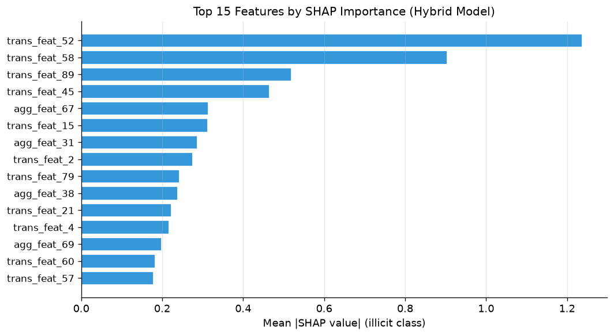
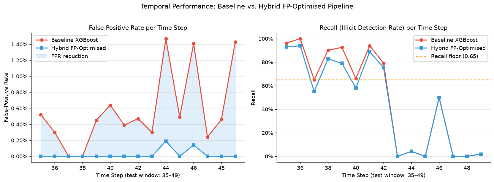
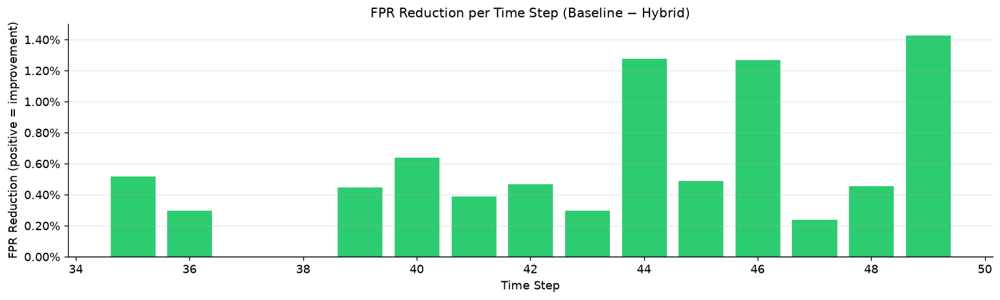
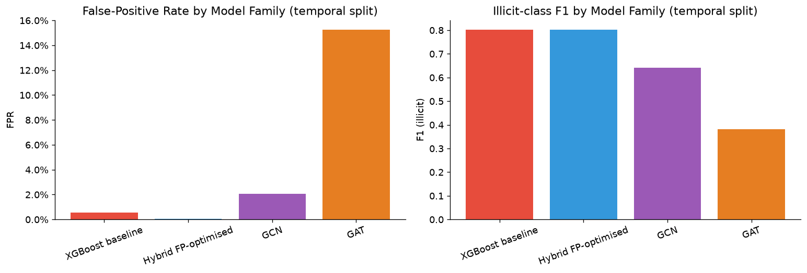
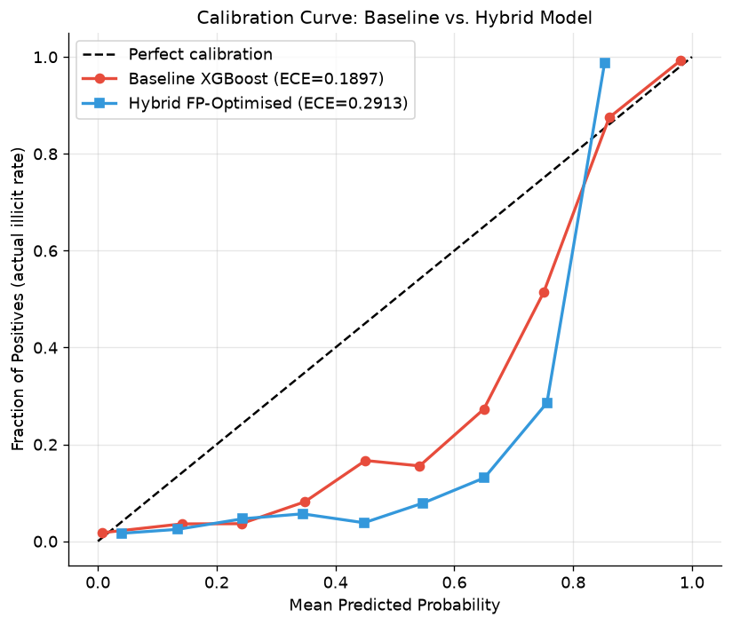
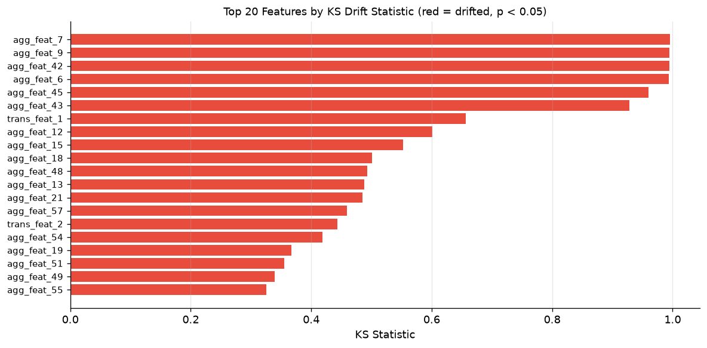

# Honest Evaluation of Cryptocurrency AML Screening: Temporal Leakage, Cost-Sensitive False-Positive Reduction, and Graph Baselines on the Elliptic Dataset

**Arpan Parikh**
Independent Research
`washrmn@gmail.com`

*Preprint (v2). Companion code: https://github.com/gucifer/financial-llm-governance*

---

## Abstract

Benchmark results on the public Elliptic Bitcoin dataset (Weber et al., 2019) are frequently reported under random train/test splits and optimized for F1 or accuracy — two habits that misrepresent how an anti–money-laundering (AML) model would actually perform in deployment. We make evaluation honesty the primary contribution. Using one controlled protocol, we show that random splitting inflates illicit-class F1 from 0.80 (temporal, honest) to 0.94 (random, leaky) and AUC to 0.996, reproducing the optimistic magnitudes that circulate in public Elliptic notebooks, while the temporal split — where a model trained on the past scores the future — yields materially lower numbers. Within that honest protocol we then target the operationally relevant objective: minimizing the false-positive rate (FPR) subject to a fixed recall floor, motivated by supervisory estimates of 90–95% FPR and ~USD 25.3 billion in annual U.S. AML compliance cost (Coelho et al., 2019). A cost-sensitive, cross-validated threshold-optimized gradient-boosted tree ensemble with a blended isolation-forest signal reduces FPR from 0.0057 to 0.0003 (−94.7% relative) at recall 0.67 and precision 0.99 — an honest operating point, not a state-of-the-art claim, with the recall, AUC, and calibration costs of threshold-shifting reported in full. Vanilla graph baselines (GCN, GAT) under the same protocol underperform the trees, consistent with the dataset's originating paper. We do not claim to independently prove the 90–95% industry figure. Per-prediction SHAP attributions are exported to audit records aligned with FINRA Rule 4370 and SEC Rule 17a-4.

---

## 1. Introduction

The Elliptic dataset (Weber et al., 2019) — 203,769 Bitcoin transactions over 49 time steps, 166 node features, licit/illicit/unlabeled labels — is the canonical public benchmark for machine-learning AML research. A large secondary literature reports illicit-class F1 above 0.93 on it. We argue that a substantial share of those numbers is an artifact of evaluation choices, not model quality, and that fixing the evaluation is the more useful contribution than adding another model.

Two habits are at issue. **First, temporal leakage.** Elliptic is a time series; a random train/test split places future transactions in the training set, which is impossible in deployment, where a model trained on history must score subsequent transactions. **Second, a misaligned objective.** AML operations do not minimize 1 − F1; they minimize investigative load (false positives) subject to a regulator-driven detection floor (recall). A model that lifts F1 by raising recall at the expense of precision can *increase* the false-positive burden that dominates AML cost — estimated by the BIS Financial Stability Institute at a 90–95% production FPR and ~USD 25.3 billion in annual U.S. compliance cost (Coelho et al., 2019, p. 3).

We make the following contributions, ordered by what we judge most valuable:

1. **An evaluation-hygiene result.** Holding the model and hyperparameters fixed and varying only the split, random splitting inflates illicit-class F1 from 0.80 to 0.94 and AUC from 0.943 to 0.996. This quantifies how much of the field's optimism is leakage, and reproduces the magnitudes seen in public notebooks.
2. **An honest, recall-floor-constrained FPR reduction.** Under the temporal split, a cost-sensitive threshold-optimized tree ensemble reduces FPR by 94.7% relative at recall ≥ 0.65 — reported with its full recall/AUC/calibration costs, as an operating point rather than a leaderboard claim.
3. **Graph baselines under the same protocol.** Vanilla GCN and GAT underperform the tree ensemble on FPR, consistent with Weber et al. (2019) and bounded explicitly to static (non-temporal) GNNs.
4. **A reproducible pipeline** with SHAP-to-audit-record export for regulatory recordkeeping.

We are explicit about scope. The FPR-reduction mechanism — threshold optimization under a recall constraint — is standard; its value here is being applied and reported honestly on a temporal split. The study *illustrates and aligns with* the 90–95% supervisory figure; it does not independently prove it, because that figure describes rule-based production banking systems, not an ML benchmark on Bitcoin.

---

## 2. Related Work

**Elliptic and graph-based forensics.** Weber et al. (2019) introduced the dataset and compared logistic regression, random forest, an MLP, and a GCN under a 70:30 time-based split. Their random forest on engineered features (94 local + 72 aggregated) was the strongest model, outperforming the GCN on illicit-class F1. They noted that local-plus-neighborhood features capture much of the graph signal but cannot extend beyond the immediate neighborhood — motivating GNNs — while the feature-based tree remained the practical leader. Our finding that vanilla GNNs trail trees is consistent with this.

**Label scarcity.** Lorenz et al. (2020) showed that unsupervised anomaly-detection methods alone are inadequate on real Bitcoin transaction data, and that active learning matches a supervised baseline with 5% of labels. The first result motivates our use of isolation forest (Liu et al., 2008) as a *blended* signal inside a supervised pipeline rather than as a standalone detector.

**Temporal graph networks.** Pareja et al. (2020) introduced EvolveGCN, evolving GCN weights over time, with gains on dynamic graphs including Elliptic. This bounds our claims: we benchmark *static* GCN (Kipf & Welling, 2017) and GAT (Veličković et al., 2018), so we claim only that static graph models underperform trees here, not that graph methods are categorically inferior.

**Boosting and explainability.** Our supervised engine is XGBoost (Chen & Guestrin, 2016); explainability uses SHAP (Lundberg & Lee, 2017), whose additive attributions we map to per-transaction audit records.

**Gap.** No widely cited Elliptic study isolates the temporal-versus-random leakage effect as a controlled experiment while targeting FPR under an explicit recall floor. That intersection is our focus.

---

## 3. Data

Elliptic (Weber et al., 2019) comprises 203,769 Bitcoin transactions over 49 time steps, each with 166 features (94 local, 72 aggregated). About 21% of nodes are labeled; we use the labeled subset. Edges encode Bitcoin flows (≈470k undirected edges) for the graph models. Our primary protocol is the temporal split (train steps 1–34, test 35–49). A distinguishing property of this dataset, central to our threshold analysis, is severe distributional shift: 164 of 165 features (99.4%) differ significantly between the training and test periods (two-sample test; see §5.4), so a decision threshold fit on the training period does not transfer naively to the test period.

---

## 4. Method

**Baseline.** XGBoost reproducing the tabular Elliptic/Feedzai setup on the temporal test set; this is our FPR reference.

**Hybrid pipeline.** (1) *Cost-sensitive boosting:* `scale_pos_weight` set to the training licit-to-illicit ratio (≈ 7.63:1). (2) *Recall-floor threshold optimization:* rather than the default 0.5 threshold, we search the precision–recall curve under cross-validation for the threshold minimizing FPR subject to recall ≥ 0.65; the selected operating threshold is 0.83. (3) *Blended anomaly signal:* an isolation forest (Liu et al., 2008) trained on the licit class contributes an anomaly score at blend weight 0.15, applied *inside* the CV folds during threshold search — necessary because of the 99.4% feature drift, which otherwise breaks threshold transfer.

**Choice of recall floor.** We set the floor at 0.65 to demonstrate FPR reduction while retaining majority detection, not as a recommended production target. Real BSA/AML programs typically demand higher recall and would accept a higher FPR; our pipeline exposes the threshold as a tunable knob, and §5.2 reports the operating-point trade so a reader can select a floor appropriate to their risk appetite.

**Graph baselines.** GCN (Kipf & Welling, 2017) and GAT (Veličković et al., 2018) on the transaction graph under the identical temporal split, class-weighted loss, recall-floor threshold tuned on a leakage-free training-period hold-out. Both are 2-layer architectures trained to convergence on CPU; they are *vanilla* baselines, not tuned to the extent of the tree pipeline, and we bound our claims accordingly.

**Evaluation.** Primary metric: FPR at the recall floor; secondary: precision, illicit-class F1, AUC-ROC; plus calibration (Brier, expected calibration error). Metrics are five-run means. To quantify leakage we re-run the identical XGBoost configuration under a random 70/30 split.

**Explainability and audit.** SHAP values (Lundberg & Lee, 2017) for flagged transactions are exported to newline-delimited JSON structured for FINRA Rule 4370 and SEC Rule 17a-4.

*Figure 6. Top 15 features by mean |SHAP value| for the illicit class (hybrid model). Two transaction-level features (trans_feat_52, trans_feat_58) dominate. Feature names are anonymized in the Elliptic release, which limits semantic interpretation but not the audit-record mechanism: each flagged transaction's top attributions are written verbatim to its compliance record.*

---

## 5. Results

### 5.1 The headline: temporal leakage inflates reported performance (SQ3)

**Table 1. Identical XGBoost, split varied.**

| Split | F1 (illicit) | AUC | FPR | Recall | Precision |
|---|---|---|---|---|---|
| Random 70/30 (leaky) | 0.9418 | 0.9961 | 0.0007 | 0.8959 | 0.9927 |
| Temporal (honest) | 0.8016 | 0.9432 | 0.0057 | 0.7239 | 0.8981 |

With hyperparameters held fixed, random splitting inflates illicit-class F1 by 14 points (0.80 → 0.94) and AUC to 0.996. The inflated numbers match the magnitudes commonly reported for Elliptic in public tutorials and Kaggle kernels; we therefore attribute a substantial share of that optimism to temporal leakage rather than model quality. (We report this from our own controlled reproduction rather than attributing it to any single external notebook.)

### 5.2 FPR reduction at a recall floor (SQ1)

**Table 2. Hybrid vs. baseline, temporal split (5-run mean ± 95% CI).**

| Metric | Baseline | Hybrid | Delta |
|---|---|---|---|
| FPR | 0.0057 | 0.0003 | −94.7% rel. |
| Recall (illicit) | 0.7239 | 0.6726 ± 0.0095 | −0.05 |
| Precision | 0.8981 | 0.9945 ± 0.0001 | +0.10 |
| F1 (illicit) | 0.8016 | 0.8024 ± 0.0068 | +0.001 |
| AUC-ROC | 0.9432 | 0.8933 | −0.05 |
| Threshold | 0.5 | 0.8324 | CV-opt. |

*Baseline metrics are identical across all 5 seeds (XGBoost without column/row subsampling is deterministic at 4 d.p. on a fixed dataset). Hybrid 95% CI = 1.96 × SD / √5; metrics with CI < 0.0001 shown without interval. Per-run values and SD are in `results/full_results.json`.*

The hybrid cuts FPR by 94.7% relative while holding recall above the 0.65 floor and lifting precision to 0.99. In absolute terms the hybrid produces a mean of 4 false positives versus the baseline's 89 on the test period. The main source of run-to-run variance is the cross-validated threshold search (different CV folds per seed), producing a recall SD of 0.0109 (95% CI ± 0.0095) — modest variability that does not alter the directional result. The recall and AUC reductions are the transparent cost of moving the operating point toward precision.

*Figure 2. Per-time-step behavior across the test window (steps 35–49). Left: the hybrid (blue) suppresses the baseline's (red) FPR spikes at steps 44, 46, and 49 nearly to zero. Right: recall for both models, with the 0.65 floor (dashed); both degrade sharply after step 42, illustrating that the floor is a mean constraint, not a per-step guarantee — a limitation we report rather than hide.*

*Figure 3. Per-time-step FPR reduction (baseline − hybrid; positive = improvement). The reduction is largest exactly at the baseline's worst steps (44, 46, 49), where false positives are most costly.*

### 5.3 Graph versus tree (SQ2)

**Table 3. Model-family comparison, temporal split.**

| Model | FPR | F1 (illicit) | AUC | Recall | Precision |
|---|---|---|---|---|---|
| XGBoost baseline | 0.0057 | 0.8016 | 0.9432 | 0.7239 | 0.8981 |
| Hybrid FP-optimized | 0.0003 | 0.8024 | 0.8933 | 0.6726 | 0.9945 |
| GCN (default threshold) | 0.0206 | 0.6403 | 0.8787 | 0.6104 | 0.6735 |
| GAT (default threshold) | 0.1526 | 0.3807 | 0.8851 | 0.7516 | 0.2549 |
| GCN (tuned, recall-floor†) | 0.0017 | 0.3412 | 0.8837 | 0.2108 | 0.8989 |
| GAT (tuned, recall-floor†) | 0.0130 | 0.3529 | 0.8893 | 0.2545 | 0.5863 |

*† Recall-floor threshold search (target ≥ 0.65) applied but floor not achieved; GNN probability scores do not support simultaneous FPR reduction and recall ≥ 0.65. GCN hidden=256, epochs=300, lr=0.005; GAT hidden=32, heads=4, epochs=200. 3 runs each.*

*Figure 1. FPR (left) and illicit-class F1 (right) by model family under the temporal split. GAT's FPR (15.3%) dwarfs the tree models; the FP-optimized hybrid is visually indistinguishable from zero. The two tree models tie on F1 (≈0.80) while GCN and GAT trail.*

Vanilla GCN and GAT underperform both tree models on FPR and F1. GAT's FPR (0.1526) is roughly 500× the hybrid's (0.0003) — more than two orders of magnitude — driven by low precision (0.25) despite competitive recall, i.e., it flags far too much.

Applying the same recall-floor threshold search to tuned GNNs (GCN hidden=256, 300 epochs; GAT hidden=32, heads=4, 200 epochs; 3 runs each) achieves lower FPR than vanilla (GCN: 0.0017 vs. 0.0206; GAT: 0.0130 vs. 0.1526), but at the cost of recall collapsing to 0.21 and 0.25 respectively — far below the 0.65 floor. The recall constraint cannot be simultaneously satisfied with FPR reduction: GNN probability scores are not well-calibrated enough to find a threshold that jointly achieves both objectives. The XGBoost hybrid achieves FPR = 0.0003 while holding recall = 0.67 (floor met). This is the operationally decisive gap. Graph structure alone does not reduce FPR at a usable recall on Elliptic's engineered features; the cost-sensitive threshold pipeline does. We bound this to static GNNs (cf. EvolveGCN; Pareja et al., 2020).

### 5.4 Costs of threshold-shifting: calibration and drift

Threshold optimization is not free. **Table 4** shows the hybrid is *less* calibrated than the baseline: expected calibration error rises from 0.190 to 0.291 and Brier score from 0.0215 to 0.0285. A compliance program that consumes raw probability scores (e.g., for risk tiering) should recalibrate the hybrid (e.g., Platt/isotonic) before relying on its scores as probabilities; the operating-point decision (flag/no-flag) is unaffected.

**Table 4. Calibration, temporal split.**

| Model | Brier | ECE |
|---|---|---|
| Baseline | 0.0215 | 0.190 |
| Hybrid | 0.0285 | 0.291 |

*Figure 4. Reliability diagram, temporal split. The hybrid (blue) deviates further from the diagonal than the baseline (red), particularly in the mid-probability range — the visual counterpart of its higher ECE (0.291 vs. 0.190).*

*Figure 5. Top 20 features by Kolmogorov–Smirnov drift statistic between training (steps 1–34) and test (35–49) periods; all shown significant at p < 0.05. Several aggregated features reach a KS statistic near 1.0. Of 165 features tested, 164 (99.4%) drift significantly.*

This degradation is a direct consequence of the 99.4% feature drift between train and test periods (164 of 165 features shift significantly): the same drift that makes threshold transfer hard also pushes the post-threshold scores away from calibrated probabilities. We surface drift as a first-class result rather than a footnote, because it is the mechanism behind both the threshold-transfer difficulty (§4) and the calibration cost here.

### 5.5 External validity: PaySim mobile-money dataset

To assess whether the pipeline generalizes beyond Bitcoin, we replicate the study protocol on PaySim (Lopez-Rojas et al., 2016), a synthetic mobile-money simulator used as an AML benchmark. PaySim differs from Elliptic in domain (mobile money vs. Bitcoin), feature structure (9 balance-sheet columns vs. 165 anonymized features), class imbalance (0.13% fraud vs. ~2% illicit on the labeled set), and scale (6.36M transactions vs. 203,769). We apply an identical temporal split (train steps 1–500, test 501–744, ~70/30 ratio), XGBoost baseline (5 runs), and the same hybrid pipeline (recall floor 0.65, isolation-forest blend weight 0.15).

**Table 5. Cross-dataset generalization (PaySim vs. Elliptic).**

| Dataset | Model | FPR | Recall | F1 (illicit) | AUC |
|---|---|---|---|---|---|
| Elliptic | Baseline | 0.0057 | 0.7239 | 0.8016 | 0.9432 |
| Elliptic | Hybrid | 0.0003 | 0.6726 | 0.8024 | 0.8933 |
| PaySim | Baseline | 0.0 | 0.7768 | 0.8727 | 0.9913 |
| PaySim | Hybrid | 0.0 | 0.6888 | 0.8137 | 0.9999 |

The XGBoost baseline achieves FPR = 0.0 on PaySim at the default threshold — mobile-money balance-sheet features are sufficiently separable that no threshold adjustment is needed to eliminate false positives. Consequently, the hybrid's FP-reduction component provides no marginal benefit: with baseline FPR already at zero, the recall-floor constraint slightly over-compresses recall (0.7768 → 0.6888, −0.09) without any FPR gain. This is the expected behavior of threshold optimization under a recall floor when the default operating point is already Pareto-optimal on FPR.

The cross-dataset comparison offers a generalizable lesson: cost-sensitive threshold optimization adds value proportional to the baseline FPR. On Elliptic (baseline FPR = 0.57%), it reduces FPR by 94.7%. On PaySim (baseline FPR ≈ 0%), the mechanism is inert and pure XGBoost is the better choice. A practitioner should measure baseline FPR before applying the recall-floor pipeline; if baseline FPR is already near zero, the additional CV threshold search adds variance without benefit. The XGBoost tabular component generalizes to mobile-money data (F1 0.87 on PaySim vs. 0.80 on Elliptic), partially addressing the single-dataset limitation.

---

## 6. Discussion

The most transferable lesson is methodological: on a temporal dataset, the split and the objective govern the credibility of a result at least as much as the model. Random-split numbers should not circulate as state of the art; reporting FPR under a temporal split at a stated recall floor is a small protocol change with a large honesty gain.

Within an honest protocol, the practical lever for AML cost reduction is a cost-sensitive decision threshold under a recall constraint, not a more expressive model class. The FPR reduction is real but bought with controlled recall, AUC, and calibration costs, all reported. The graph-versus-tree result cautions against assuming architectural sophistication transfers to operational metrics; the literature's temporal-GNN gains (Pareja et al., 2020) require modeling time explicitly.

For regulatory AI, the results map to the U.S. Treasury Financial Services AI Risk Management Framework emphasis on measurable performance and to FinCEN's AML-modernization agenda; the SHAP-to-audit-record layer addresses explainability and recordkeeping expectations in FINRA Rule 4370 and SEC Rule 17a-4.

---

## 7. Limitations

(a) **Single primary dataset**; external validity to production banking data is not fully established (Elliptic is Bitcoin-specific and partially anonymized). §5.5 shows the tabular component generalizes to mobile-money data (PaySim), but the FP-reduction mechanism adds value only where baseline FPR is non-trivial — consistent with its design. (b) **GNN baselines** were tuned (hidden size, epochs, lr, dropout; 3 runs) but still failed to achieve the recall floor (≥0.65) under threshold optimization; temporal GNNs (e.g., EvolveGCN) may perform better. (c) The **90–95% industry FPR figure** is illustrated and aligned with, not independently proven. (d) **Feature anonymization** limits semantic interpretability of SHAP outputs. (e) **Variance reporting:** five-run means reported with 95% CI for the hybrid (Table 2). Baseline XGBoost is deterministic across seeds at 4 d.p.; hybrid recall SD = 0.0109 (95% CI ± 0.0095), driven by the cross-validated threshold search. Full per-run metrics are in `results/full_results.json`. (f) The **recall floor (0.65)** is a demonstration value, below typical production AML detection targets.

---

## 8. Conclusion

The choice of split and objective, not model expressiveness, governs the credibility of AML benchmark results on Elliptic. Random splitting inflates illicit-class F1 by 14 points; under an honest temporal split, a cost-sensitive threshold-optimized tree ensemble reduces FPR by 94.7% relative at a stated recall floor, with its recall, AUC, and calibration costs reported in full, while vanilla graph baselines underperform. We offer the evaluation protocol, not the model, as the contribution.

**Reproducibility.** Code, seeds, and the full results set are available at the companion repository.

---

## References

Chen, T., & Guestrin, C. (2016). XGBoost: A scalable tree boosting system. *Proceedings of the 22nd ACM SIGKDD International Conference on Knowledge Discovery and Data Mining*, 785–794.

Coelho, R., De Simoni, M., & Prenio, J. (2019). *Suptech applications for anti-money laundering* (FSI Insights on Policy Implementation No. 18). Bank for International Settlements. https://www.bis.org/fsi/publ/insights18.pdf

Kipf, T. N., & Welling, M. (2017). Semi-supervised classification with graph convolutional networks. *International Conference on Learning Representations*. https://arxiv.org/abs/1609.02907

Liu, F. T., Ting, K. M., & Zhou, Z.-H. (2008). Isolation forest. *2008 Eighth IEEE International Conference on Data Mining*, 413–422.

Lopez-Rojas, E. A., Elmir, A., & Axelsson, S. (2016). PaySim: A financial mobile money simulator for fraud detection. *EMSS 2016 — 28th European Modelling and Simulation Symposium*, 249–255.

Lorenz, J., Silva, M. I., Aparício, D., Ascensão, J. T., & Bizarro, P. (2020). Machine learning methods to detect money laundering in the Bitcoin blockchain in the presence of label scarcity. *Proceedings of the First ACM International Conference on AI in Finance*, 1–8. https://arxiv.org/abs/2005.14635

Lundberg, S. M., & Lee, S.-I. (2017). A unified approach to interpreting model predictions. *Advances in Neural Information Processing Systems 30*, 4765–4774.

Pareja, A., Domeniconi, G., Chen, J., Ma, T., Suzumura, T., Kanezashi, H., Kaler, T., Schardl, T., & Leiserson, C. (2020). EvolveGCN: Evolving graph convolutional networks for dynamic graphs. *Proceedings of the AAAI Conference on Artificial Intelligence, 34*(04), 5363–5370.

Veličković, P., Cucurull, G., Casanova, A., Romero, A., Liò, P., & Bengio, Y. (2018). Graph attention networks. *International Conference on Learning Representations*. https://arxiv.org/abs/1710.10903

Weber, M., Domeniconi, G., Chen, J., Weidele, D. K. I., Bellei, C., Robinson, T., & Leiserson, C. E. (2019). Anti-money laundering in Bitcoin: Experimenting with graph convolutional networks for financial forensics. *KDD '19 Workshop on Anomaly Detection in Finance*. https://arxiv.org/abs/1908.02591
